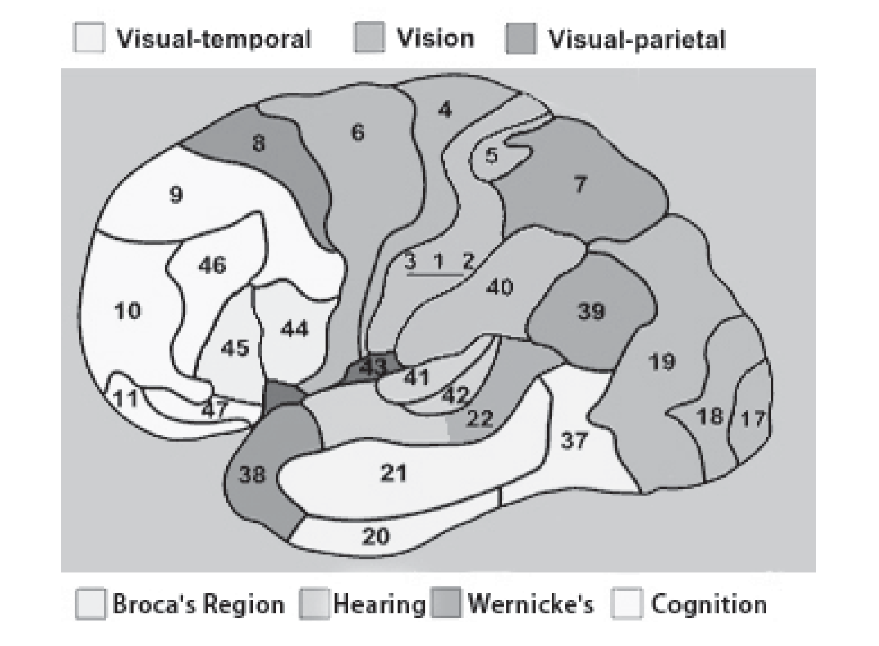

# Animal Models of Memory
Studies in monkeys with lesions to the hippocampus and surrounding cortex have been invaluable in learning about the contributions of the medial
temporal lobe to primate memory systems. In general, the goal of such research is to develop animal models of human memory and amnesia.
Through research, such models are providing key information on relations between specific memory and brain structures.

Several animal species, ranging from invertebrates to monkeys, have been investigated for clues to human memory and its functional neuroanatomy
and neurobiology. **It is likely that monkeys will contribute the most directly applicable knowledge about human processes at the systems level
given the similarity among primate brains**.

> *We must always keep in mind, however, that the gross organisation and functional capabilities of the brains of monkeys and humans differ
> significantly. Thus, animal models of cognitive processes like memory are perhaps most informative when linked with studies in humans.*

One of the key questions in memory research was **how much the hippocampus alone, as compared with surrounding structures in the medial temporal lobe,
participated in the memory deficits of patients like `H.M`**.

In other words, **what structures of the medial temporal lobe system are involved in episodic memory?**

For example, **does the amygdala influence memory deficits in amnesics?**

> *Data from amnesics indicate that the `amygdala is not part of the brain’s episodic memory system`, although it has a role in emotion
> and emotional memories. To verify this, surgical lesions were created in the medial temporal lobe and amygdala of monkeys, to cause memory
> impairment.*

In classic work by `Mortimer Mishkin (1978)` at the `National Institute of Mental Health (NIMH)`, the hippocampus or the amygdala,
or both the hippocampus and the amygdala, of monkeys were removed surgically. He found that **the amount of impairment, as measured on tests,
varied according to what was lesioned**.

In his early work, `Mishkin` found that **in the monkey, memory was impaired only if the lesion included the hippocampus and amygdala**.
This led to the idea that the `amygdala was a key structure in memory`.

The idea does not fit well with data from amnesics like R.B., who had anterograde amnesia caused by a lesion restricted to neurons of the
hippocampus and no damage to the amygdala. `Stuart Zola and colleagues (1993)` at the University of California at San Diego investigated this
dilemma. They performed more selective lesions of the brains of monkeys by distinguishing between the amygdala and hippocampus, as well as
the surrounding cortex near each structure. They surgically created lesions of the amygdala, the entorhinal cortex, or the surrounding neocortex
of the parahippocampal gyrus and the perirhipal cortex `(Brodmann’s areas 35 and 36)` `(Figure 1.3.3)`.

*Figure 1.3.3: **Brocas areas of the brain***

They found that **lesions of the hippocampus and amygdala produced the most severe memory deficits only when the cortex surrounding these
regions was also lesioned**. **When lesions of the hippocampus and amygdala were made but the surrounding cortex was spared, the presence
or absence of the amygdala lesion did not affect the monkey’s memory**.

**The amygdala, then, could not be part of the system that supported the acquisition of long-term memory**. In subsequent investigations,
`Zola and his colleagues` selectively created lesions of the surrounding cortex in the `perirhinal`, `entorhinal`, and `parahippocampal` regions.
**This worsened memory performance in delayed nonmatching to sample tests.**

Follow-up work showed that **lesions of only the parahippocampal and perirhinal cortices also produced significant memory deficit.**

How does this make sense in relation to R.B’s profound anterograde amnesia with damage limited to the hippocampus and not involving the
surrounding para- hippocampal or perirhinal cortex?

> *The parahippocampal and perirhinal areas receive information from the `visual`, `auditor`, and `somatosensory association cortex` and send
> these inputs to the `hippocampus`, and from there to other `cortical regions`. The hippocampus cannot function properly if these vital
> connections are damaged. But more than this, we now also know that these regions are involved in much processing themselves, and hence
> `lesions restricted to the hippocampus do not produce as severe a form of amnesia as do lesions that include surrounding cortex`.*

In summary, the data from animals are highly consistent with evidence from amnesic patients such as R.B. and H.M. that implicates the
**hippocampal system in the medial temporal lobe and the associated cortex as critical for forming long-term memories**. **Lesions that damage
the hippocampus directly, or damage the input-output relation of the hippocampus with the neocortex, produce severe memory impairments**.

The amygdala is not a crucial part of the system for episodic memory but is important for emotional memory. Moreover, the animal data match
well with those from amnesics with regard to the preservation of short-term memory processes after the medial temporal lobe has been damaged.
Monkeys memory deficits in the delay mismatching to sample task became more pronounced as the interval between the sample and test increased.
**The medial temporal lobe, then, is not essential for short-term or working memory processes**.

As we noted earlier, **the medial temporal lobe is not the locus of long-term storage because retrograde amnesia is not total after damage
to this area, rather, the medial temporal lobe is a key component in organising and consolidating long term memory that is permanently stored
in a distributed fashion in the neocortex.**
