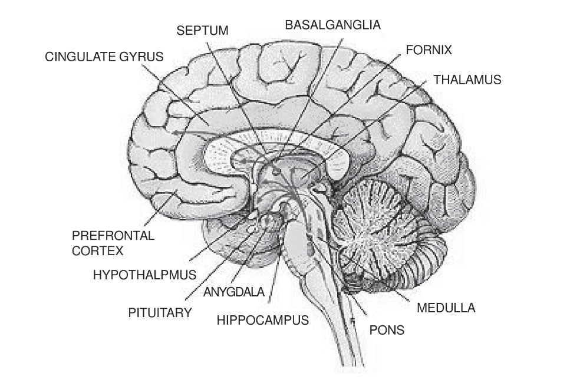
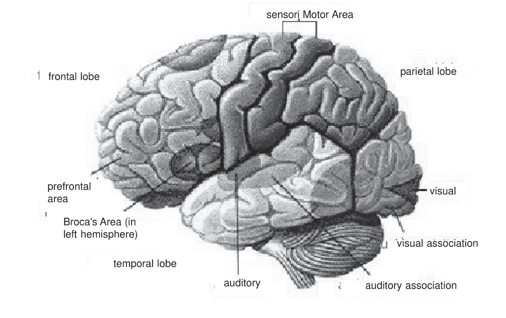

# Memory and Brain
The field of the cognitive and experimental psychology of memory is rich with theory and data and has produced a consistent set of concepts
about the organisation of human memory. The neuro scientific studies of memory are important, both to understand how they have contributed to
general theories of memory, and to investigate how specific neural circuits and systems enable the learning and retention of specific forms
of knowledge.

## Human Memory, Brain Damage and Amnesia
**Deficits in memory as a function of brain damage, disease, or psychological trauma are known as amnesia**. Amnesia can involve either
the inability to learn new things or a loss of previous knowledge, or both. It can differentially affect short-term/ working memory and
long-term memory abilities.

Thus, by examining amnesia in conjunction with cognitive theories derived from experiments on normal subjects, we can understand the organisation
of memory at a functional and a neural level. **Much compelling information about the organisation of human memory during amnesia was first
derived from medical treatments that left patients amnesic**.

The history is fascinating, and so let’s begin by turning back the clock more than fifty years.

## Brain Surgery and Memory Loss
In the late 1940s and early 1950s, surgeons attempted to treat neurological and psychiatric disease using a variety of neurosurgical procedures,
including `prefrontal lobotomy` (removing or disconnecting the prefrontal lobe), `corpus callosotomy` (surgically sectioning the corpus callosum),
`amygdalotomies` (removing the amygdala), and `temporal lobe resection` (removal of the temporal lobe) `(Figure 1.3.1)`.

These surgical procedures opened a new window on human brain function as they revealed, usually quite by accident, fundamentally important
principles of the organisation of human cognition. One surgical procedure relevant to memory was removal of the medial portion of the temporal lobe,
including the hippocampal formation.

In 1953 at a medical conference, the neurosurgeon `William Beecher Scoville` from the `Montreal Neurological Institute` reported on
bilateral removal of the medial temporal lobe in one epileptic patient and several schizophrenic patients. Shortly thereafter he wrote:

> *Bilateral resection of the `uncus`, and `amygdalum` alone, or in conjunction with the entire `pyriform amygdaloid hippocampal complex`, has
> resulted in no marked `physiologic` or `behavioural` changes with the one exception of a very grave, recent `memory loss`, so severe as to
> prevent the patient from remembering the locations of the rooms in which he lives, the names of his close associates, or even the way to the
> toilet.... `(Scoville, 1954)`*.

`Scoville` and psychologist `Brenda Milner` did the neuropsychological examination of ten patients. Milner found that **memory impairments in
the patients having medial temporal lobe resections as part of their treatment were in relation to how much of the medial temporal lobe was
removed**. The farther posterior along the medial temporal lobe the resection was, the worse the amnesia.

Strikingly, however, **only bilateral resection of the hippocampus resulted in severe amnesia**. In comparison, in one patient whose entire
right medial temporal lobe (hippocampus and hippocampal gyrus) was removed, no residual memory deficit was found `(Figure 1.3.1)`.
But the interesting patient was the young man who had had bilateral medial temporal resection.

*Figure 1.3.1 **Medical View of Human Brain***

> ### *The case history of patient H.M.*
> *H.M. was a young man who suffered from a difficult-to-treat from of epilepsy that progressed in severity during his teen years.
> Over the years his physicians had treated him with the available drugs to minimize his seizures, but these drugs were largely ineffective
> for him. As his seizures worsened in his twenties, he decided to try a then-radical new therapy that involved surgery. **At that time
> neurologists knew that many seizures originated in the medial portions of the temporal lobe and from there spread to other areas of the brain,
> leading to violent seizures and often loss of consciousness**. It was also becoming increasingly clear that surgically removing the brain
> region in which the seizure activity originated, the so-called seizure focus, could help patients with epilepsy. The decision in H.M.’s case
> was to remove his medial temporal lobe bilaterally, in a procedure called `temporal lobectomy`*

Following recovery from this major neurosurgical procedure, H.M.’s epilepsy did improve. The surgery was a success, both with regard to his
surviving the risks associated with any surgery of the brain and with regard to the epilepsy. However, physicians, family, and friends began
to realise that H.M. was experiencing new difficulties.

**For example**,

> *a year and a half after the surgery, which was performed in `September 1953`, H.M. displayed clear problems with his memory. Although it was
> `April 1955` and H.M. was `29 years old`, he reported his age to be `27`. H.M. would say he did not remember ever meeting certain individuals,
> even when he actually spoke to them a few minutes earlier and they merely left the room, returning after a short delay!*

**H.M. was profoundly amnesic that is, he suffered from disorders of memory*. However, H.M. did not have the kind of amnesia one sees depicted
in television shows or movies, where the character has a total loss of all prior memories. Indeed, H.M. knew who he was and could remember
things about his life, that is, up until a period prior to his surgery.

However, **it became increasingly clear that H.M. could not form new long-term memories**. Formal neuropsychological tests were performed on
H.M. to establish the nature of his cognitive deficits. These tests showed that his intelligence was well above normal after the surgery.
He also had no perceptual or language problems and seemed generally fine, with no changes in his personality or motivation.

However, when memory tests were administered, H.M. scored well below normal. **The bilateral removal of H.M.’s medial temporal lobe produced a highly selective deficit in his memory ability, leaving other cognitive functions intact.** H.M. had normal short-term memory (sensory registers and
working memory), but he developed a severe and permanent inability to acquire and store new information `(Figure 1.3.2)`.
The transfer of information from short-term storage to long-term memory was disrupted.

*Figure 1.3.2: **Major Areas of the Brain***

## Amnesia and the Medial Temporal Lobe
Which region or regions of the medial temporal lobe were critical for supporting the long-term memory ability lost in H.M.?
The medial temporal area includes `(Figure 1.3.1)`:
- Amygdala
- Hippocampus
- Entorhinal cortex
- Surrounding parahippocampal and perirhinal cortical areas

For the past 40 years, scientists studying H.M. used surgical reports of his lesions to guide theories of memory and amnesia and their neural bases.
Reports by Scoville, who performed the surgery, indicated that all of H.M.’s hippocampus in each hemisphere had been removed. H.M.’s brain
and surgical lesions were re-evaluated with improved accuracy with high-resolution neuroimaging methods such as magnetic resonance imaging (MRI),
and it was found that **in addition to the hippocampus, some of H.M.’s surrounding cortex was also removed**.

Is damage to the hippocampus sufficient to block the formation of new long- term memories?

> *Consider another patient, `R.B`., who lost his memory after an `ischemic episode` (reduction of blood to brain) during bypass surgery.
> R.B. developed `dense anterograde amnesia` similar to H.M.’s. He could not form new long-term memories. He also had `retrograde amnesia` that
> extended back to 1 to 2 years, slightly less severe than H.M.’s retrograde loss. After his death, R.B.’s brain was donated for study,
> permitting a detailed analysis of the extent of his neuroanatomical damage. **In R.B.’s case, lesions were found to be restricted to his hippocampus
> within each hippocampus, R.B. had sustained a specific lesion restricted to the CA1 pyramidal cells.***

These findings in patient R.B. support the idea that the hippocampus is crucial in forming new long-term memories. **R.B.’s case also supports
the distinction between areas that store long-term memories and the role of the hippocampus in forming new memories**.

Even though retrograde amnesia is associated with medial temporal lobe damage, it is temporally limited and does not affect long term
memories of events that happened more than a few years prior to the amnesia inducing event.
