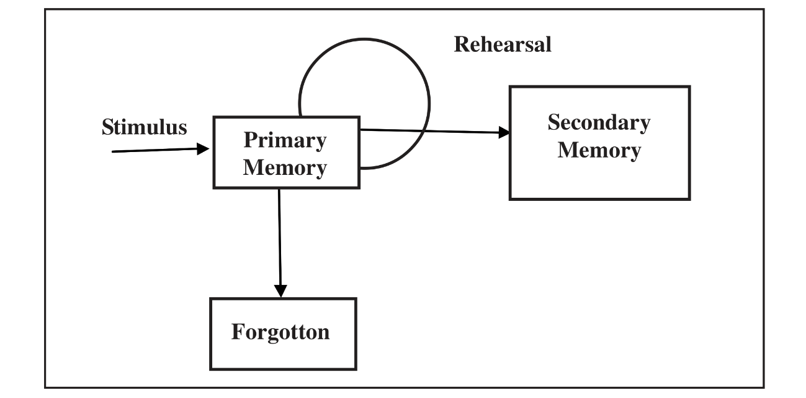

# Waugh and Norman’s Model of Primary And Secondary Memory
The first modern behavioural model to travel down memory lane, and one whose concept of primary memory has served as a departure point for most
modern theories, was developed by `Waugh and Norman (1965)`. The theory is dualistic:

> *`primary memory (PM)`, a short-term storage system, is conceptualised as being independent of `secondary memory (SM)`, a longer-term storage
> system.*

Waugh and Norman borrowed freely from William James’s dichotomy of primary and secondary memory and illustrated their theory by means of the
model shown in Figure below, which encouraged the memory metaphor of boxes in the head that soon proliferated in the literature of cognitive
psychology.

What Waugh and Norman did that James never attempted was to quantify properties of primary memory. **This short-term storage system was taken to
have very limited capacity, so that loss of information from it was postulated to occur not as a simple function of time but (once the storage
capacity was exhausted) by displacement of old items by new ones.**

> *PM could be conceptualised as a storage compartment much like a vertical file, in which information is stored in a slot or, if all the slots
> are filled, displaces an item occupying one of the slots.*

*Figure 1.4.1: **Model of Primary and Secondary Memory** (Adapted from Waugh and Norman (1965)*

`Waugh and Norman` traced the fate of items in PM (primary memory) by using lists of `sixteen digits`, that were read to subjects at the rate of
one digit per second or four digits per second. The purpose of presenting digits every second or quarter second was to determine whether forgetting
was a function of decay (presumed to be due to time) or interference in PM.

> *If forgetting was a function of decay, then less recall could be expected with the slower rate (one digit per second),
> if forgetting was a function of interference in PM, then no difference in recall could be expected according to the presentation rate.*

The same amount of information is presented at both presentation rates, which, by Waugh and Norman’s logic, allows the same time for decay to occur.
**It might be argued that even at one item per second, subjects would allow extra experimental information to enter their PM, but later experimentation
`(Norman, 1966)` in which presentation rates varied from one to ten digits (for a given period), yielded data  consistent with a rate of forgetting
expected from the original model.**

The rate of forgetting for the two presentation rates is similar. Interference seems to be a greater factor than decay in forgetting in PM.
Waugh and Norman’s system makes good sense. PM holds verbal information and is available for verbatim recall, this is true in our ordinary
conversation. We can recall that last part of a sentence we have just heard with complete accuracy, even if we were barely paying attention to
what was said. However, to recall the same information sometime later is impossible unless we rehearse it, which makes it available through SM.

