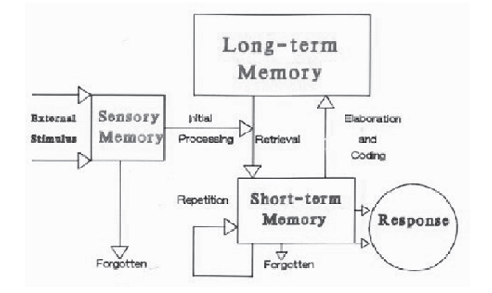

# Atkinson and Shiffrin’s the Stage Model
Traditionally, the most widely used model of information processing is the stage theory model, based on the work of `Atkinson and Shiffrin (1968)`.
**The key elements of this model are that it views learning and memory as discontinuous and multi-staged.**

It is hypothesised that **as new information is taken in, it is in some way manipulated before it is stored.** The stage theory model, as shown
in `Figure 1.4.2`, recognises three types or stages of memory:
- Sensory memory
- Short term or working memory
- Long-term memory.

*Figure 1.4.2: **A Stage Model of Memory** (adapted from aktinson and shriffin 1969)*

**In the Atkinson-Shiffrin model, memory starts with a sensory input from the environment.** This input is held for a very brief time, several
seconds at most, in a sensory register associated with the sensory channels `(vision, hearing, touch, and so forth)`. This occurs in as little
as `1/2` second for visual stimuli `(Sperling, 1960)`, and about 4 or 5 seconds for auditory stimuli `(Darwin et al., 1972)`.

The transfer of new information quickly to the next stage of processing is of critical importance, and sensory memory acts as a portal for all
information that is to become part of memory. There are many ways to ensure transfer and many methods for facilitating that transfer. To this
end, attention and automaticity are the two major influences on sensory memory, and much work has been done to understand the impact of each on
information processing. Information that is attended to and recognised in the sensory register may be passed on to second stage of information
processing, i.e. `short-term memory (STM)` or `working memory`, where it is held for perhaps 20 or 30 seconds.

This stage is often viewed as `active` or `conscious` memory because it is the part of memory that is being actively processed while new information
is being taken in. Some of the information reaching short-term memory is processed by being rehearsed that is, by having attention focused on it,
perhaps by being repeated over and over (maintenance rehearsal), or perhaps by being processed in some other way that will link it up with other
information already stored in memory (elaborate rehearsal).

Generally `5 + 2` number of units can be processed at any given time in STM. Information that is rehearsed may then be passed along to long-term
memory (LTM); information not so processed is lost. When items of information are placed in long-term memory, they are organised into categories,
where they may reside for days, months, years, or for a lifetime.

When you remember something, a representation of the item is withdrawn, or retrieved, from long-term memory.

## Organisations of long-term memory
Each of the memory unit or structures represented in the mind is distinct and serves a different operational function. However, it is evident
that some type of very specialised categorisation system exists within the human mind. One of the first to make this idea explicit was `Bruner`
(as cited in `Anderson, 1998`).

**Based upon the idea of categorisation, Bruner’s theory states ‘To perceive is to categorise, to conceptualise is to categorise, to learn is
to form categories, to make decisions is to categorise**.

`Tulving (1972)` was the first to distinguish between `episodic` and `semantic memory`. **Episodic memories are those which give a subject the
sense of remembering the actual situation, or event `(Eliasmith, 2001)`**.

> *`Episodic memory’s` store is centered on personal experience and specific events. It is entirely circumstantial and it is not generally used
> for the processing of new information except as a sort of backdrop.*

> *`Semantic memory`, in contrast, deals with general, abstract information and can be recalled independently of how it was learned.
> **It is semantic memory that is the central focus of most current study because it houses the concepts, strategies and other structures that are
> typically used for encoding new information.***

Most researchers now combine these two in a broader category labeled declarative. Other researchers have identified additional organisational types.

For example:

> *`Abbott  lists declarative and procedural while  Huitt (2000 , citing the work of Paivio (1971, 1986)` adds imagery to this list.
> However, `Pylyshyn (2002)` states that imagery is not a distinct organisational structure, but follows the rules that apply to semantic
> and episodic memory. `Abbott (2002) and Huitt (2000)` define declarative memory as that which can be talked about or verbalised*.

It is, then, the sum of stored information that can be readily retrieved and put into words in conscious thought and sharing. As previously stated,
**declarative memory can be subdivided into both semantic and episodic memories.** Procedural memory can be thought of as “how to” knowledge
`(Huitt, 2000)i. It is the type of long-term memory sometimes associated with information that has reached a state of automaticity, but it not
limited to this. This type of memory is defined in terms of learned skills and the ability to recall instruction-like memory.

> *`Paivio (1971, 1986)` describes `imagery` as **the memory structure for collecting and storing information related to pictures.
> It captures information much like a photograph and can be extremely useful for context and visual presentation of information.***

## Information Processing in Three Stage Model
`Atkinson` and `Shiffrin` make an important distinction between the concepts of memory and memory stores, they use the term memory to refer to
the data being retained, while store refers to the structural component that contains the information. Simply indicating how long an item has
been retained does not necessarily reveal where it is located in the structure of memory.

Information processing from one store to another is largely controlled by the subject. Information briefly held in the sensory register is
scanned by the subject, and selected information is introduced into the STS.

Transfer of information from the STS was regarded as capable of taking place so long as it was held there.
`Atkinson` and `Shiffrin` postulated that information might enter the long- term store directly from the sensory register.

