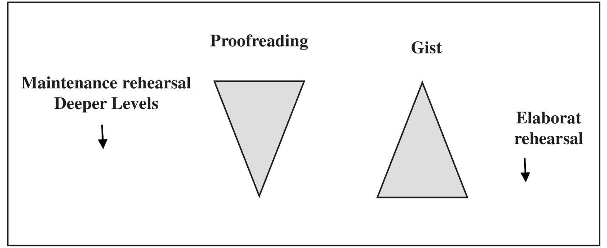

# Levels of Processing: Craik and Lockhart
It is likely that progress in the early stages of scientific development is made more by reaction and counterreaction than by the discovery
of great immutable truths. `Craik and Lockhart’s (1972) levels-of-processing (LOP)` model, as a reaction against the boxes-in-the-head
scheme of memory, is consistent with that view.

They take the position that **data can be better described by a concept of memory based on levels of processing**. The general idea is
that **incoming stimuli are subjected to a series of analyses starting with shallow sensory analysis and proceeding to deeper, more complex,
abstract, and semantic analyses**. Whether a stimulus is processed at a shallow or deep stage depends on the nature of the stimulus and the time
available for processing.

**An item processed at a deep level is less likely to be forgotten than one processed at a shallow level**.

- At the earliest level, incoming stimuli are subjected to sensory and featural analyses.
- At a deeper level, the item may be recognised by means of pattern recognition and extraction of meaning.
- At a still deeper level, it may engage the subject’s long-term associations.
- With deeper processing a greater degree of semantic or cognitive analysis is undertaken.

> *Consider word recognition, for example.
> At the preliminary stages, the visual configuration may be analysed according to such physical or sensory features as lines and angles.
> Later stages are concerned with matching the stimuli with stored information for example, `recognition that one of the letters corresponds to
> the pattern identified as A.` At the highest level, the recognised pattern **may trigger associations, images or stories on the basis of
> the subject’s past experience with the word** `(Craik & Lockhart, 1972)`.*

The significant issue, in Craik and Lockhart’s view, is that **we are capable of perceiving at meaningful levels before we analyse information
at a more primitive level. Thus, levels of processing are more a `spread` of processing, with highly familiar, meaningful stimuli more likely
to be processed at a deeper level than less meaningful stimuli. That we can perceive at a deeper level before analysing at a shallow level casts
grave doubts on the original levels-of-processing formulation**.

Perhaps we are dealing simply with different types of processing, with the types not following any constant sequence. If all types are equally
accessible to the incoming stimulus, then the notion of levels could be replaced by a system that drops the notion of levels or depth but retains
some of Craik and Lockhart’s ideas about rehearsal and about the formation of memory traces.

A model that is closer to their original idea is shown in `Figure 1.4.3`. This figure depicts the **memory activation involved in proofreading
a passage as contrasted with that involved in reading the same passage for the gist of the material**. Proofreading, that is, looking at the
surface of the passage, involves elaborate shallow processing and minimal semantic processing.

Reading for gist, that is, trying to get the essential points, involves minimal shallow processing, or `maintenance rehearsal` (held in memory
without elaboration), but elaborate semantic processing.

> *Another example of this latter kind of memory activity would be a typist who concentrates on responding to letter sequences but has very
> little understanding of the material being typed. As a result of some studies `(Craik & Watkins, 1973; and Lockhart, Craik, & Jacoby, 1975)`,
> the idea that stimuli are always processed through an unvarying sequence of stages was abandoned, while the general principle that some sensory
> processing must precede semantic analysis was retained.*

*Figure 1.4.3: **Memory activation in two kind of reading.** (Adapted from Solso, 2006)*

## Levels of Processing versus Information Processing.
> *Information-processing models of memory have generally stressed structural components `(for example, sensory store, STM, and LTM)` dealing
> with processing `(for example, attention, coding, rehearsal, transformation of information, and forgetting)` as operations that are tied
> `(sometimes uniquely)` to the structural components.*

*However, another approach is to postulate process and then to formulate a memory system in terms of these operations. `Craik and Lockhart` have
taken just such a position, and their implicit criticism of the information processing model `(along with Neisser, 1976)` suggests that it
is falling on hard times. **Where information-processing models of memory stress the sequence of stages through which information is moved
and processed, this alternate viewpoint argues that memory traces are formed as a by -product of perceptual processing.** Thus, the durability
of memory is conceptualised as a function of the depth of processing.

Information that is not given full attention and is analysed only to a shallow level is soon forgotten, information that is deeply processed
attended to, fully analysed and enriched by associations or images is long lasting.

The levels-of-processing model is not free of criticism `(see Craik & Tulving, 1975; and Baddeley, 1978)`. The criticism includes that
- It seems to say little more than that meaningful events are well remembered, a mundane conclusion.
- It is vague and generally untestable.
- It is circular in that any events that are well remembered are designated `deeply processed`, with no objective and independent index of
depth available.

One clear difference between the `boxes-in-the-head theory (Waugh and Norman, and Atkinson and Shiffrin)` and the `levels-of-processing theory
(Craik and Lockhart)` is their respective notions concerning rehearsal.

> *In the former, **rehearsal, or repetition, of information in STM serves the function of transferring it to a longer-lasting memory store.***

> *In the latter, **rehearsal is conceptualised as either maintaining information at one level of analysis or elaborating information by processing
> it to a deeper level.***

The first type, maintenance rehearsal, will not lead to better retention. `Craik and Tulving (1975)` tested the idea that words that are
deeply processed should be recalled better than those that are less so. They did this by having subjects simply rate words as to their
structural, phonemic, or semantic aspects.

`Craik and Tulving` measured both the time to make a decision and recognition of the rated words. The data  obtained are interpreted
as showing that

- Deeper processing takes longer to accomplish.
- Recognition of encoded words increases as a function of the level to which they are processed, with those words engaging semantic aspects
better recognised than those engaging only the phonological or structural aspects.

Using slightly different tasks, `D’Agostino, O’Neill, and Paivio (1977)`, `Klein and Saltz (1976)` and `Schulman (1974)` obtained similar results.

